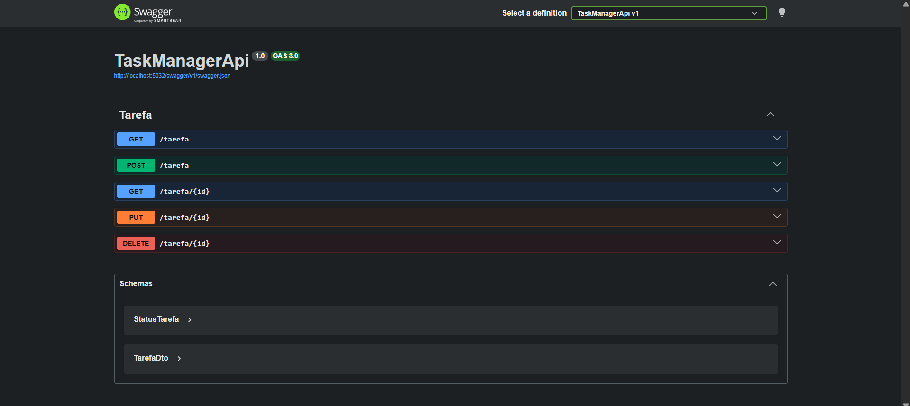
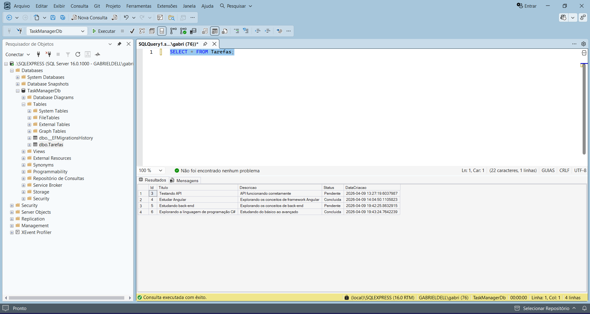
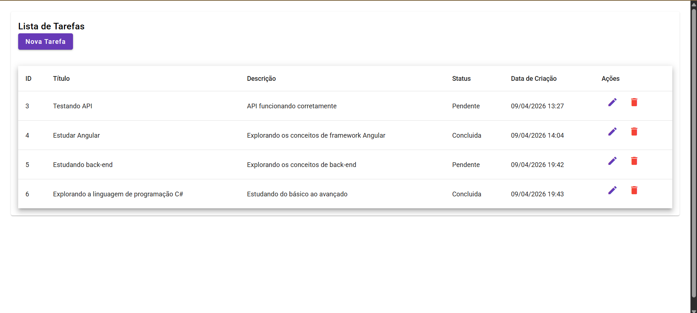

# Task Manager API
Aplicação web para cadastro e gerenciamento de tarefas, desenvolvida para o desafio técnico do Bootcamp Protagonize Tech Avanade.

### Tecnologias utilizadas:
- .NET 10 (ASP.NET Core Web API)
- Entity Framework Core
- SQL Server
- ORM
- Swagger (documentação de API)
- Angular 17 + Material UI

### Funcionalidades no back-end:
- CRUD Completo
- Validação de dados com Data Annotations
- Uso de enum para status (Pendente / Concluida)
- Persistência de dados com Entity Framework

### Estrutura de projeto do back-end:
- Controllers → Endpoints da API
- Services → Regras de negócio
- Repositories → Acesso ao banco de dados
- DTOs → Transferência de dados
- Models → Entidades do sistema

### Endpoints da API no back-end
| Método | Rota | Descrição |
|--------|------|-----------|
| GET | /api/Tarefa | Listar todas as tarefas |
| GET | /api/Tarefa/{id} | Buscar tarefa por ID |
| POST | /api/Tarefa | Criar nova tarefa |
| PUT | /api/Tarefa/{id} | Atualizar tarefa |
| DELETE | /api/Tarefa/{id} | Excluir tarefa |

## Exemplo de requisição da API:
```json
{
  "titulo": "Estudar Angular",
  "descricao": "Front-end",
  "status": "Concluida"
}
```

## Resposta da API:
```json
[
    {
        id: 3,
        titulo: "Testando API",
        descricao: "API funcionando corretamente",
        status: "Pendente",
        dataCriacao: "2026-04-09T13:27:19.6037987"
    },
    {
        id: 4,
        titulo: "Estudar Angular",
        descricao: "Explorando os conceitos de framework Angular",
        status: "Concluida",
        dataCriacao: "2026-04-09T14:04:50.1105823"
    },
    {
        id: 5,
        titulo: "Estudando back-end",
        descricao: "Explorando os conceitos de back-end",
        status: "Pendente",
        dataCriacao: "2026-04-09T19:42:25.8632915"
    },
    {
        id: 6,
        titulo: "Explorando a linguagem de programação C#",
        descricao: "Estudando do básico ao avançado",
        status: "Concluida",
        dataCriacao: "2026-04-09T19:43:24.7642239"
    }
]
```

### Testes
A API pode ser testada via Swagger ou ferramentas de teste como Postman.

### Observações:
- O campo Status utiliza enum (Pendente, Concluida)
- Os dados são persistidos no SQL Server
- A API segue o padrão REST

### Demonstração do Projeto no back-end:



## 🌐 Front-end

Aplicação desenvolvida em Angular 17 para consumo da API.

### Funcionalidades:
- Listagem de tarefas
- Criação de tarefas
- Edição de tarefas
- Exclusão de tarefas

## Demonstração do Projeto no front-end:


### Como rodar o projeto

## Back End:
```bash
cd backend/TaskManagerAPI
dotnet run
```

## Front End:
```bash
cd frontend/task-manager-frontend
npm start
```

## Autor
Gabriel Conceição
